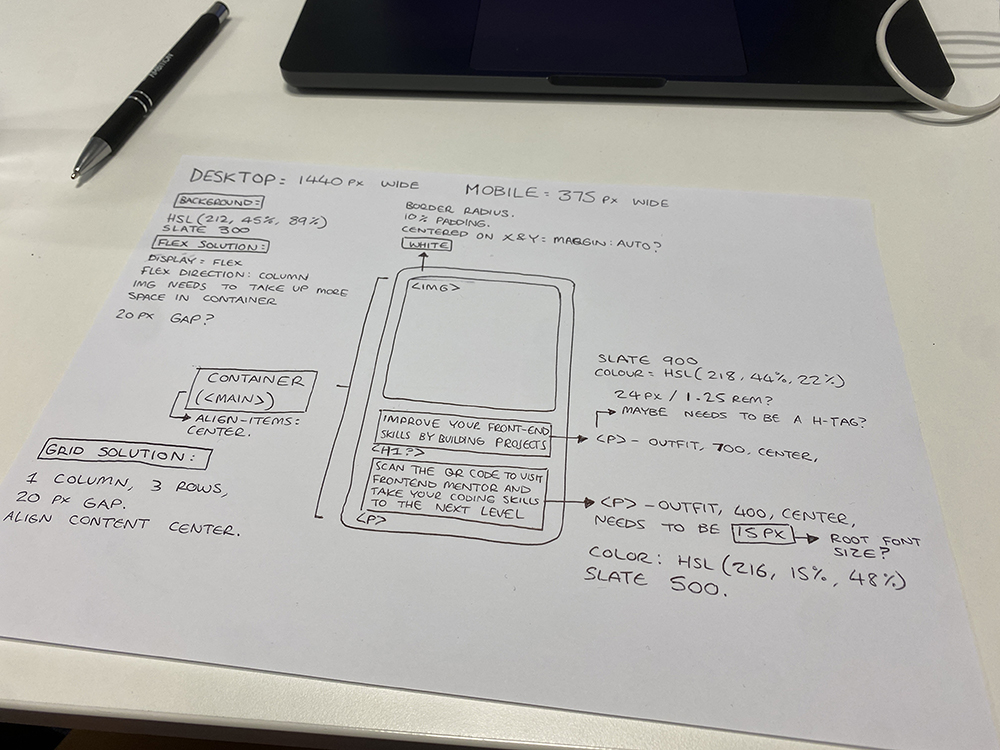

# Frontend Mentor - QR code component solution

Hello! Thank you for reading and reviewing my QR Code Component Solution.

This is a solution to the [QR code component challenge on Frontend Mentor](https://www.frontendmentor.io/challenges/qr-code-component-iux_sIO_H).  

## Table of contents

  - [Links](#links)
  - [My process](#my-process)
  - [Built with](#built-with)
  - [What I learned](#what-i-learned)
  - [Continued development](#continued-development)
  - [Useful resources](#useful-resources)
  - [Author](#author)


### Links

- Live Site URL: [https://sophieregulars-qr-code-component.netlify.app/](https://sophieregulars-qr-code-component.netlify.app/)

## My process

I broke the problem down initially via pen and paper to work out how I needed to structure my CSS:



Once I had a visual reference of what I needed to do, I worked down the cascade - starting at the elements that would be used more generally like colours that could be custom properties, the background, etc...then to the main container, then down to the items inside the container like the `````` & text content. 

I wanted the content inside the container to adjust with it, so I tried to make their sizing inherit / update with the main containers settings, to keep it responsive. 

### Built with

- Semantic HTML5 markup
- CSS custom properties
- Flexbox

### What I learned

I learned how to structure my assets dynamically, so that nothing was hard-coded in any pixel units, and everything was updateable in as little locations as possible. This is also the first project I've written the CSS for almost entirely from scratch, which I was really proud of! Here is what it looked like:


```css
:root {
    --slate300: hsl(212, 45%, 89%);
    --slate400: hsl(216, 15%, 48%);
    --slate900: hsl(218, 44%, 22%);
}


html {
 background-color: var(--slate300);
 font-family: "Outfit", sans-serif;
 font-size: 15px;
}

.main-container {
background-color: white;
border-radius: 1rem;
width: 19rem;
position: absolute;
top: 50%;
left: 50%;
transform: translate(-50%, -50%);
padding: 1rem;
display:flex;
flex-direction: column;
align-items: center;
justify-content: center;
text-align: center;
filter: drop-shadow(10px 20px 10px rgba(0 0 0 / 5%));
}


.text-container {
padding: 3% 4% 0% 3%;
}

img {
border-radius: inherit;
width:inherit;
height: auto;
}

h1 {
color:var(--slate900);
font-weight: 700;
font-size: 1.5rem;
}

p {
color:var(--slate400);
font-weight: 400;
line-height: 1.5;
}
```

### Continued development

From here, I'd really love to learn how to build multiple components and chain them together to create a full page layout

### Useful resources

- [Web.Dev's CSS Course](https://web.dev/learn/css/) - This course absolutely changed the game for me and broke almost every aspect of CSS down into a really easy to understand manner. I really recommend this if you're a beginner like I am!

- [CSS Tricks Guide](https://css-tricks.com/guides/) - Another really useful CSS Resource


## Author

- Github - [Sophie Regular](https://github.com/Sophieregular)
- Frontend Mentor - [@Sophieregular](https://www.frontendmentor.io/profile/Sophieregular)

